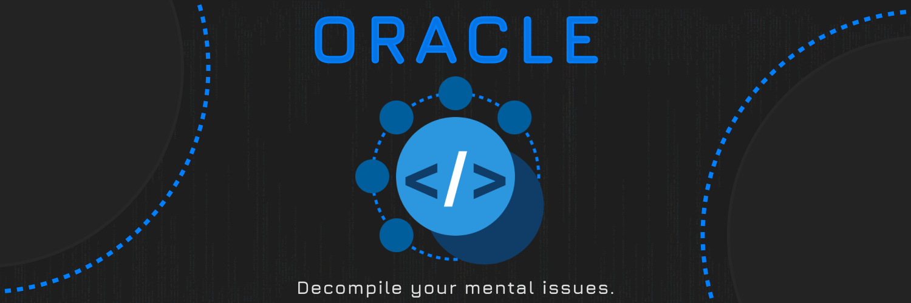

# DataModelPatch

Accurate decompilation of the Roblox Player's distribution of DataModelPatch.rbxm, including the universal `LuaApp`

> [!WARNING]
> This is a WIP decompilation; it is not quite yet ready for re-compilation.

### Goal 

The goal of this decompilation is to achieve correct re-compilation of `LuaApp` and similar files. The core scripts are updated to upstream every 1-2 weeks aside from decompiler bug fixes.  

### Credits

* [reggie](https://github.com/regginator) - `rbxm2fs` dumper ([`luauc/PatchRoot/`](luauc/PatchRoot) output)
* [TheGreatSageEqualToHeaven](https://github.com/TheGreatSageEqualToHeaven) - Outputting decompiled source code from bytecode output ([`src/PatchRoot/`](src/PatchRoot))
* Of course, the [Oracle](https://discord.gg/prHW9TA4QW) decompiler for decompilation of Luauc bytecode 🙂

## 🤝 Contributing 

- Contributions to fix buggy code because of decompiler bugs are accepted. 
- Contributions to make `RobloxScript`-exclusive work on `LocalScript` permissions are also accepted.
- Other contributions can be reviewed to see if they are eligible to merge. 

## 🚫 Problems

* Some files may have had unhandled control flow and improperly decompiled, which would result in incorrect table and `goto` output

## 🏛️ Licensing

Some of the original source code from DMPatch is/was licensed under the Apache-2.0 license, while some is also proprietary and exclusively owned by Roblox Corporation ("Roblox"). Furthermore, any source code from this decompilation should be considered unlicensed code.

## Decompiler

These files were decompiled by the Oracle decompiler. 

Discord Invite: https://discord.gg/prHW9TA4QW

